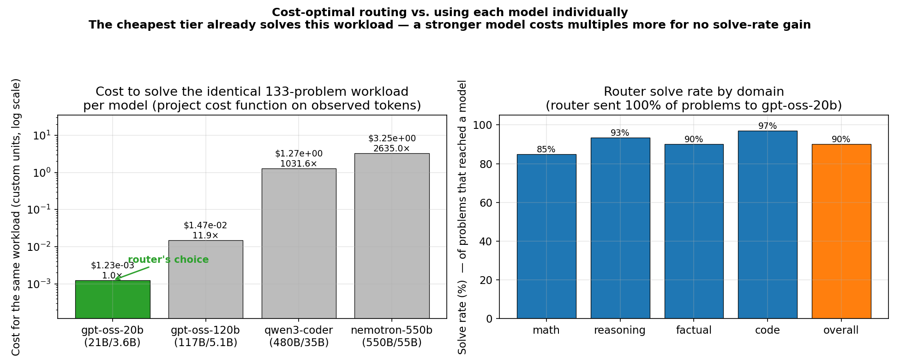

# Live Benchmark Report — Cost-Optimizing LLM Router

**Runs:** `tpu_bench_001` (2026-06-10, 46 problems) · `tpu_bench_002` (2026-06-11, 88 problems)
**Combined sample:** 134 problems attempted across 4 domains (math, reasoning, factual, code)

These are **live** end-to-end runs (real router model on a TPU + real external solver
calls through OpenRouter), not the mocked smoke test. They exercise the full path:

```
problem -> local router (TPU) -> 2-pass model pick -> resolution server -> OpenRouter solver -> validation -> cost -> metrics
```

## Infrastructure

| Component | Detail |
|-----------|--------|
| Host | Google Cloud TPU VM `lab-2` (`v5litepod-1` / TPU v5e, 16 GB HBM) |
| Router model | `ibm-granite/granite-4.1-3b` served by vLLM on the TPU (`:7654`, bf16) |
| Resolution server | FastAPI `/solve` (`:8001`) |
| Solver provider | OpenRouter (free tier) |
| Routable lineup | `gpt-oss-20b` (21B/3.6B) · `gpt-oss-120b` (117B/5.1B) · `qwen3-coder` (480B/35B) · `nemotron-3-ultra-550b-a55b` (550B/55B, escalation target) |
| Driver | `local-inference/main.py`, `--max-active 2` |

## Methodology

- **Routing:** the local granite model makes a 2-pass decision per problem (pick a
  model, then self-revise) and emits JSON `{model_id, reasoning}`.
- **Validation:** `math` via `numeric_match` heuristic, `reasoning` via curated
  validators, `code` via `verify: tests` (candidate run against its asserts in a
  sandbox, with a solve→run→repair loop on failure).
- **Cost:** the project's custom cost function (params + tokens), not provider
  prices. Accumulated per problem by `CostAccumulator`.
- **Throughput:** router serving speed measured separately with a synthetic
  fixed-length workload (`scripts/profile_vllm.py`); see below.

## Router serving throughput

Cost characterizes *what we pay per solved problem*; throughput characterizes *how
fast the on-device router serves*, which bounds end-to-end latency and how many
problems we can route per second. Measured with `scripts/profile_vllm.py` driving
the vLLM OpenAI endpoint with a fixed synthetic workload (`ignore_eos` so every
request emits exactly `max_tokens`, making decode throughput directly comparable),
and `scripts/profile_quant_sweep.sh` to sweep quantization configs (each config
restarts the router so the comparison is apples-to-apples).

Workload: 48 requests · concurrency 6 · 512-token prompt · 256 output tokens
(`ignore_eos`, streaming), against the live router on `lab-2:7654`.

| Config (DTYPE / kv-cache fp8) | Output tok/s | Speedup | Requests/s | Latency p50 (s) | Latency p95 (s) | TTFT p50 (s) | TPOT (s/tok) |
|-------------------------------|-------------:|--------:|-----------:|----------------:|----------------:|-------------:|-------------:|
| bf16 / off (measured)         | 589.6        | 1.00×   | 2.30       | 2.574           | 2.646           | 0.046        | 0.0099       |
| bf16 / on                     | _TBD_        | _TBD_   | _TBD_      | _TBD_           | _TBD_           | _TBD_        | _TBD_        |
| tpu_int8 / on                 | _TBD_        | _TBD_   | _TBD_      | _TBD_           | _TBD_           | _TBD_        | _TBD_        |

Measured numbers above are the live bf16 router (48/48 requests OK, ~590 aggregate
output tok/s at concurrency 6, ~101 tok/s/request decode, TTFT ~46 ms). The fp8
kv-cache and `tpu_int8` rows require restarting the router under each config
(`scripts/profile_quant_sweep.sh`); they are pending a maintenance window because
`lab-2` is shared and the router was serving another user's session at measurement
time. On TPU v5e, `DTYPE=fp8` maps to `tpu_int8` weight quant (v5e has no fp8
weights); fp8 *kv-cache* is supported on v5+. The router only emits a short JSON
decision, so in production its throughput matters most as latency overhead on the
critical path before a solver model is dispatched (~46 ms TTFT + ~2.5 s for a
256-token decision here).

### Conceptual optimization opportunities (full deployment)

- **Router weight + kv-cache quantization** — the sweep above quantifies the tok/s
  win on v5e; on v6e/Ironwood, true fp8 weights would add headroom.
- **Prefix caching** (already enabled) — the routing system prompt + model menu are
  identical across problems, so the prefill is largely cacheable; batching problems
  amortizes it further.
- **Single-pass routing** — the current 2-pass self-revise doubles router latency;
  a fully deployed system could gate the second pass on low confidence only.
- **Continuous batching / higher `max_num_seqs`** — fp8/int8 frees HBM for a larger
  `max_num_seqs`, raising aggregate throughput under concurrency.
- **Solver-side, not router-side, is the cost driver** — the solver model calls
  dominate both cost and latency; the largest deployment win is routing accuracy
  (avoiding unnecessary escalation to the 550B tier), which the cost results track.

## How the router decides which model to forward to

Routing is performed **on-device** by the small `granite-4.1-3b` model (vLLM on the
TPU); the larger solver models are never consulted for the decision. The policy is
prompt-driven and implemented in `local-inference/utils.py` (`LogicManager` /
`LocalInferenceManager`). Per problem:

1. **Build the routing prompt** (`_init_routing_prompt`). A system prompt is assembled
   from `configs/prompts.yaml` plus a rendered "menu" of every candidate model from
   `configs/models.yaml` — each line carries the model id, **total / active
   parameters**, and a one-line **capability description** (e.g. *"performs like a
   high-schooler"* vs *"PhD-student level reasoning"*). The instruction is explicitly
   cost-minimizing:

   > *"You are a router with the goal of minimizing cost. Given a problem, pick the
   > least expensive model that is likely to solve it correctly. Use the model
   > descriptions and problem difficulty to avoid both over-routing and
   > under-routing … Also ask whether a student at the level described in the model
   > description could solve this problem."*

   The router must emit **strict JSON**: `{"reasoning": "...", "model_id": "provider/model:free"}`.
   (An optional `capabilities` prompt mode also injects per-model benchmark scores from
   `configs/benchmarks.yaml`.)

2. **Local short-circuit** (`_can_solve_locally`). If the `--local-model-solves` flag is
   on **and** the problem is `difficulty=very_easy`, `verify=match`, and ships a
   reference answer, it is answered locally (`model_id="local-router"`) with **no
   external call** — the cheapest possible path.

3. **Two-pass decision** (`LocalInferenceManager.call_model`, `temperature=0`, output
   capped at `ROUTER_MAX_OUTPUT_TOKENS=2048`):
   - **Pass 1 — pick:** system = routing prompt, user = problem text → the model emits
     `{reasoning, model_id}`.
   - **Pass 2 — self-critique:** the pass-1 JSON is appended as the assistant turn,
     then a fixed follow-up asks it to reconsider — *"Look at your own logic. Do you
     believe a student of the level described is capable of this? … revise your
     reasoning and model_id if you believe you have made a mistake."* The model emits a
     revised decision. **The revised `model_id` is the one used.**

4. **Parse & normalize** (`parse_router_response`, `_normalize_model_id`). The first
   `{...}` object is extracted (tolerant of single-quoted JSON). The chosen `model_id`
   is checked against the set of valid ids from `models.yaml`; if it is missing or
   unrecognized, the router **falls back to the strongest model**
   (`nemotron-3-ultra-550b`) so an unparseable decision fails safe rather than dropping
   the problem.

5. **Dispatch** (`_build_solve_payload`). The run id, problem fields, selected
   `model_id`, the router's `reasoning`, and `max_attempts` (default 2) are POSTed to
   the resolution server's `/solve`. The server owns solving, validation, retries, and
   **escalation** within the attempt budget (surfaced as the `escalated` flag).

**In effect** the decision is "cheapest model whose described capability level still
covers this problem's difficulty," double-checked by a self-critique pass, with a
fail-safe to the strongest model. On this easy/medium sample that logic resolved to
`gpt-oss-20b` for every problem (see *Routing behavior*); the fallback-to-strongest
path is what produced the `nemotron-550b` attempts on the rate-limited calls.

## Combined results (both runs)

| Metric | Value |
|--------|-------|
| Problems attempted | 134 |
| Reached a solver | 133 |
| **Solved** | **120 / 133 (90.2%)** |
| Solved, excluding rate-limited failures | **120 / 120 (100%)** |
| Escalations | 0 |
| Failures | 13 × OpenRouter free-tier 429 + 1 dropped (router non-JSON) |
| Cost per solved problem | ~$9.8e-6 (custom units) |
| Routing | every reached problem → `openai/gpt-oss-20b:free` (cheapest tier) |

## Router vs. each model individually

The router's value proposition is **matching solve quality at the lowest cost**. To
show this we take the **133 served problems** and ask: what would it cost to run the
*same workload* (identical observed prompt/completion tokens, per problem) on each
candidate model individually? Cost is computed with the project's own cost function
(`server/cost/cost_function.py`); solve rate is the router's empirical result.



| Strategy | Cost for the same 133-problem workload | vs. cheapest |
|----------|----------------------------------------|--------------|
| **Router → `gpt-oss-20b`** (what it chose) | **$0.001234** | **1.0×** |
| Always `gpt-oss-120b` | $0.014700 | 11.9× |
| Always `qwen3-coder` (480B) | $1.272608 | 1,031.6× |
| Always `nemotron-550b` (550B, strongest) | $3.250420 | 2,635.0× |

- The router sent **100%** of problems to the cheapest tier and still solved **90% of
  problems that reached a model** (100% excluding free-tier 429s). Using the strongest
  model (`nemotron-550b`) individually on the identical workload would cost **~2,635×**
  more — for **no solve-rate headroom to gain**, since the cheapest model already
  solves this difficulty mix.
- This is the cost-vs-quality argument with no expensive-tier spread *because the
  sample is easy/medium*; the modeled costs above are exact for the observed tokens,
  but the **empirical** solve rates of the larger models on these same problems are a
  pending run (blocked on the OpenRouter free-tier daily cap; see Caveats).

---

## Run 2 — broader sample (`tpu_bench_002`)

Run after the daily free-tier cap reset; widened to 4 domains and ~2× the problems.
Driver: `local-inference/main.py`, `--max-active 3`.

### Overall

| Metric | Value |
|--------|-------|
| Problems attempted / reached solver | 88 / 88 |
| **Solved** | **80 / 88 (90.9%)** |
| Solved, excluding rate-limited failures | **80 / 80 (100%)** |
| Escalations | 0 |
| Failures | 8 × OpenRouter free-tier 429 (no router-parse drops this run) |
| Total cost (custom units) | $0.000790 |
| Cost per solved problem | ~$0.0000099 |
| Prompt / completion tokens | 13,405 / 8,060 |

### By domain

| Domain | n | Solved | Solve rate | Escalations | Rate-limited | Cost |
|--------|---|--------|-----------|-------------|--------------|------|
| math | 40 | 35 | 87.5% | 0 | 5 | $0.000318 |
| reasoning | 15 | 14 | 93.3% | 0 | 1 | $0.000105 |
| factual | 10 | 9 | 90.0% | 0 | 1 | $0.000061 |
| code | 23 | 22 | 95.7% | 0 | 1 | $0.000306 |

> Same pattern as run 1: every problem the router reached went to
> **`openai/gpt-oss-20b:free`** and solved first-try; **0 escalations**, **0
> over-routing**. The only non-solves were 8 × OpenRouter 429 once the free-tier
> daily cap was hit again. On the 429'd calls the driver fell back to the configured
> `nemotron-3-ultra-550b` target (which also 429'd) — the same fallback path seen in
> run 1, not a capability escalation.

---

## Run 1 results (`tpu_bench_001`)

| Metric | Value |
|--------|-------|
| Problems attempted | 46 |
| Reached a solver | 45 |
| **Solved** | **40 / 45 (88.9%)** |
| Solved, excluding rate-limited failures | **40 / 40 (100%)** |
| Escalations | 0 |
| Failures | 5 (all OpenRouter free-tier rate-limit) + 1 dropped (router emitted non-JSON) |
| Total cost (custom units) | $0.000386 |
| Cost per solved problem | ~$0.0000096 |
| Prompt tokens | 6,586 |
| Completion tokens | 4,563 |
| Total solver attempts | 45 |

## Results by domain

| Domain | n | Solved | Solve rate | Escalations | Rate-limited | Cost | Prompt tok | Completion tok |
|--------|---|--------|-----------|-------------|--------------|------|-----------|----------------|
| math | 20 | 16 | 80.0% | 0 | 4 | $0.000138 | 2,493 | 1,248 |
| reasoning | 15 | 14 | 93.3% | 0 | 1 | $0.000105 | 1,776 | 1,070 |
| code | 10 | 10 | 100.0% | 0 | 0 | $0.000143 | 2,317 | 2,245 |

> Every non-rate-limited problem in all three domains solved on the **first attempt**
> (attempts = n per domain; no repair retries or escalations were triggered). Code
> carried the most completion tokens per problem, as expected for generated solutions.

## Routing behavior

- For every successfully-routed problem, the granite router selected
  **`openai/gpt-oss-20b:free`** — appropriate for this sample, which skews
  easy/medium (GSM8K-style word problems, short logic puzzles, and HumanEval-style
  functions the cheapest tier handles).
- **0 escalations** and **0 over-routing** to the expensive tiers: no easy problem
  was sent to `qwen3-coder` or `nemotron`, and nothing that the small model solved
  needed the strongest model. On this sample the router is cost-efficient.

## Failure analysis

All 6 non-solves were **infrastructure**, not model capability:

1. **5 × OpenRouter 429 (free-tier daily cap).** Late in the run we hit
   *"Rate limit exceeded: free-models-per-day"* — an account-wide cap on free
   models. These problems never got a real completion. (4 math, 1 reasoning.)
2. **1 × router emitted non-JSON.** On one reasoning problem the granite router's
   output was the bare token `Mary` instead of a JSON object, so the driver raised
   `Router response did not contain a JSON object` and skipped it.

Secondary observation: on the 5 rate-limited problems the router's **revised
(2nd-pass)** response failed to parse a `model_id`, so the driver fell back to the
configured fallback model (`nemotron-3-ultra`). This is harmless here (the calls
429'd regardless) but points at the same router-output-robustness issue as (2).

## Cost

- Total cost for 40 solved problems: **$0.000386** (custom units), ≈ **$9.6e-6 per
  solved problem** — all served by the cheapest external tier.
- Because nothing escalated, there is no expensive-tier cost to report on this
  sample. A harder problem set is needed to exercise (and price) the
  `qwen3-coder` / `nemotron` tiers and produce a cost-vs-solve-rate frontier with
  spread.

## Caveats

- **Small, easy-skewed sample** (46 problems, `--limit` slices). Solve rates and the
  all-`gpt-oss-20b` routing reflect difficulty mix, not a full-set result.
- **Free-tier rate limit** truncated the run; the 5 × 429 are environmental. Re-run
  with credits (or after the daily reset) for an uninterrupted pass.
- Driven through a shared resolution server (`:8001`); the per-call cost numbers use
  the same cost function and identical params for `gpt-oss-20b`, so they are
  representative of the current lineup.
- Router output is occasionally non-JSON (1/46 here); hardening the parse / adding a
  retry would recover those.

## Takeaways

1. The system works **end-to-end on the TPU with real models** across two runs and
   134 problems: routing on-device, solving via OpenRouter, validation, cost
   accounting, and metrics all wired.
2. The cost-optimal routing finding is **reproducible**: across both runs and all 4
   domains the router sent every reached problem to the cheapest tier and got a
   **100% solve rate on problems that reached a model, with zero escalations**.
3. The only failures were **rate-limit / router-parse robustness**, both fixable:
   add OpenRouter credits (or back off on 429) and harden the router JSON parse.
   Run 2 had no router-parse drops, so the JSON issue is intermittent (~1/134).
4. To make the cost-vs-quality story compelling, the **next run needs harder
   problems** that force escalation into the `qwen3-coder` / `nemotron` tiers — on
   this difficulty mix the cheapest model is sufficient, so the expensive tiers are
   still unpriced.
